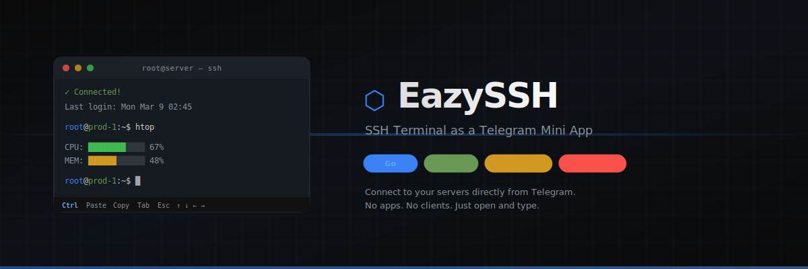

<div align="center">



<br /><br />

**از طریق تلگرام به سرورهات SSH بزن.**

یه ترمینال SSH کامل به شکل مینی‌اپ تلگرام.
نیازی به نصب اپ یا کلاینت نیست. فقط باز کن و وصل شو.

[](LICENSE)
[](backend/)
[](https://telegram.org)

[امکانات](#-امکانات) · [نصب](#-نصب) · [نصب دستی](#-نصب-دستی) · [کانال تلگرام](https://t.me/SchmitzWS)

**[🇬🇧 English](README.md)**

</div>

---

## ✨ امکانات

- 🖥 **ترمینال واقعی** — xterm.js کامل با رنگ، اسکرول و ریسایز خودکار
- 🔐 **احراز هویت دوگانه** — اتصال با پسورد یا کلید SSH (با پشتیبانی passphrase)
- 📱 **موبایل فرست** — نوار کنترل لمسی: Ctrl+C/D/Z/L، Tab، Esc، فلش‌ها، کپی/پیست
- 💾 **ذخیره سرورها** — لیست سرورها بعد از بستن اپ هم باقی می‌مونه
- 🛡 **فقط تلگرام** — اعتبارسنجی HMAC-SHA256 initData — بدون دسترسی از بیرون
- 🎨 **ظاهر بومی** — تم تلگرام (تاریک/روشن) خودکار اعمال میشه
- ⚡ **سریع** — بکند Go با WebSocket، بدون تأخیر محسوس

## 🏗 معماری

```
┌──────────────────┐     WebSocket (wss://)     ┌──────────────────┐     SSH (tcp/22)     ┌──────────────┐
│  تلگرام          │ ◄──────────────────────►   │  بکند Go         │ ◄──────────────────► │  سرور شما    │
│  (مینی‌اپ)        │     رمزنگاری + اعتبارسنجی  │  (WebSocket→SSH) │     SSH استاندارد    │  (هرجایی)     │
└──────────────────┘                             └──────────────────┘                      └──────────────┘
```

## 📋 پیش‌نیازها

- یه **VPS** با اوبونتو ۲۲+ و IP عمومی
- یه **دامنه** (تلگرام HTTPS میخواد)
- **توکن بات تلگرام** از [@BotFather](https://t.me/BotFather)

Docker خودکار نصب میشه اگه نداشته باشید.

## 🚀 نصب

### مرحله ۱ — رکورد DNS بساز

دو رکورد A بساز که به IP سرورت اشاره کنن:

```
ssh-terminal.yourdomain.com  →  IP_سرور
ssh-api.yourdomain.com       →  IP_سرور
```

> اگه کلادفلر داری، فعلاً پروکسی رو خاموش کن (ابر خاکستری).

### مرحله ۲ — اسکریپت نصب رو اجرا کن

SSH بزن به سرورت و اجرا کن:

```bash
git clone https://github.com/Schmi7zz/eazy-ssh.git /opt/ssh-terminal
cd /opt/ssh-terminal
bash install.sh
```

اسکریپت این موارد رو ازت میپرسه:

| سوال | مثال | از کجا بگیرم |
|------|-------|-------------|
| ساب‌دامنه فرانت | `ssh-terminal.example.com` | DNS مرحله ۱ |
| ساب‌دامنه بکند | `ssh-api.example.com` | DNS مرحله ۱ |
| توکن بات | `123456:ABC-DEF...` | [@BotFather](https://t.me/BotFather) → `/newbot` |
| آیدی ادمین تلگرام | `123456789` | [@userinfobot](https://t.me/userinfobot) |
| یوزرنیم بات | `EazySSH_bot` | یوزرنیمی که توی BotFather انتخاب کردی |
| اسم کوتاه مینی‌اپ | `terminal` | هر اسمی که بخوای (a-z, 0-9, _) |
| ایمیل | `you@email.com` | برای گواهی SSL |

بعد خودکار انجام میده:

1. نصب Nginx، Certbot، Docker، python-telegram-bot
2. بیلد و اجرای بکند Go (WebSocket)
3. تنظیم Nginx ریورس پراکسی
4. گرفتن گواهی SSL از Let's Encrypt
5. جایگذاری دامنه‌ها توی همه فایل‌های کانفیگ
6. راه‌اندازی بات تلگرام به عنوان سرویس systemd

### مرحله ۳ — تنظیم BotFather

بعد از نصب، برو پیش [@BotFather](https://t.me/BotFather):

**دکمه منو رو ست کن:**
1. `/setmenubutton` → بات رو انتخاب کن
2. URL: `https://ssh-terminal.yourdomain.com`
3. عنوان: `Open Terminal`

**مینی‌اپ بساز:**
1. `/newapp` → بات رو انتخاب کن
2. عنوان، توضیح، عکس (640×360)
3. Web App URL: `https://ssh-terminal.yourdomain.com`
4. Short name: همون اسمی که موقع نصب وارد کردی (مثلاً `terminal`)

### مرحله ۴ — تمام! 🎉

`t.me/YOUR_BOT/terminal` رو توی تلگرام باز کن → سرور اضافه کن → وصل شو!

## 🔧 مدیریت

```bash
# لاگ بکند
docker-compose -f /opt/ssh-terminal/docker-compose.yml logs -f

# ریستارت بکند
docker-compose -f /opt/ssh-terminal/docker-compose.yml restart

# لاگ بات
journalctl -u ssh-terminal-bot -f

# ویرایش کانفیگ
nano /opt/ssh-terminal/.env

# آمار کاربران (توی تلگرام)
/stats
```

## 📖 نصب دستی

<details>
<summary>اگه ترجیح میدی دستی نصب کنی به جای <code>install.sh</code>، اینجا کلیک کن.</summary>

<br>

**۱. نصب وابستگی‌ها:**
```bash
apt update && apt install -y nginx certbot python3-certbot-nginx python3-pip git
pip3 install python-telegram-bot --break-system-packages
```

**۲. کلون و تنظیم:**
```bash
git clone https://github.com/Schmi7zz/eazy-ssh.git /opt/ssh-terminal
cd /opt/ssh-terminal
cp .env.example .env
nano .env   # پر کن: BOT_TOKEN, WEBAPP_URL, ADMIN_ID, USERS_FILE
```

**۳. ویرایش فرانت:**
```bash
nano frontend/index.html
# WS_URL رو عوض کن: wss://ssh-api.yourdomain.com/ws
# لینک تلگرام رو عوض کن: https://t.me/YOUR_BOT/YOUR_APP
```

**۴. بیلد بکند:**
```bash
docker compose up -d --build
curl http://localhost:8080/health   # باید بنویسه: ok
```

**۵. تنظیم Nginx:**
```bash
cp nginx.conf.example /etc/nginx/sites-available/ssh-terminal
nano /etc/nginx/sites-available/ssh-terminal   # yourdomain.com رو عوض کن
ln -s /etc/nginx/sites-available/ssh-terminal /etc/nginx/sites-enabled/
nginx -t && systemctl reload nginx
```

**۶. گواهی SSL:**
```bash
certbot --nginx -d ssh-terminal.yourdomain.com -d ssh-api.yourdomain.com
```

**۷. اجرای بات:**
```bash
cp ssh-terminal-bot.service /etc/systemd/system/
systemctl daemon-reload && systemctl enable ssh-terminal-bot && systemctl start ssh-terminal-bot
```

</details>

## 📁 ساختار پروژه

```
eazy-ssh/
├── backend/
│   ├── main.go              # پراکسی Go: WebSocket→SSH با احراز هویت تلگرام
│   ├── go.mod
│   └── Dockerfile
├── frontend/
│   └── index.html           # مینی‌اپ React (تک فایل، CDN)
├── bot.py                   # بات تلگرام (/start, /stats)
├── install.sh               # اسکریپت نصب تعاملی
├── docker-compose.yml
├── nginx.conf.example
├── ssh-terminal-bot.service
├── .env.example
├── LICENSE
├── README.md
└── README.fa.md
```

## 🔒 امنیت

- **اعتبارسنجی تلگرام** — هر اتصال WebSocket با HMAC-SHA256 اعتبارسنجی میشه. بدون نشست معتبر تلگرام = بدون دسترسی.
- **بدون ذخیره سمت سرور** — اطلاعات SSH هر بار ارسال میشن و هرگز روی بکند ذخیره نمیشن.
- **فقط سمت کلاینت** — لیست سرورها توی localStorage وبویو تلگرام ذخیره میشه.
- **HTTPS همه‌جا** — تمام ترافیک با TLS رمزنگاری شده.
- **محدودیت Origin** — متغیر محیطی اختیاری `ALLOWED_ORIGIN`.

## 🤝 مشارکت

Pull request خوش‌آمده! برای باگ یا درخواست قابلیت جدید issue باز کنید.

## 📬 ارتباط

[](https://t.me/SchmitzWS)

## 📄 لایسنس

[MIT](LICENSE) — استفاده کن، فورک کن، شیپ کن.
